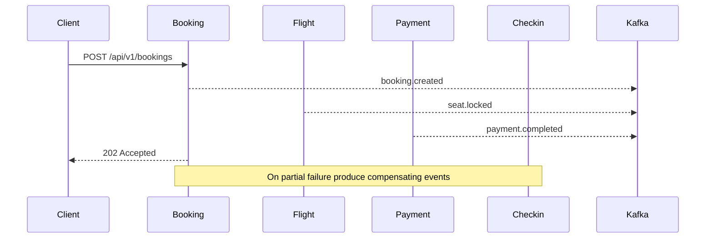
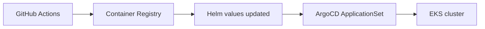
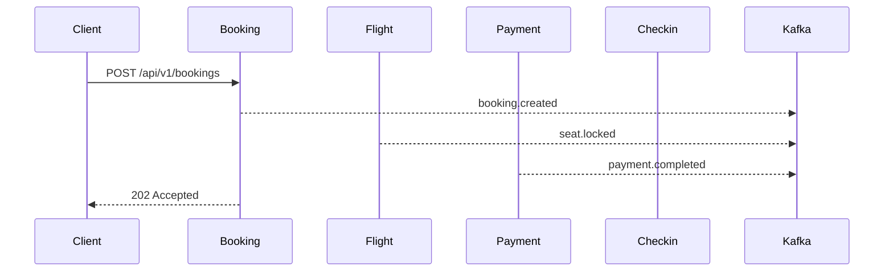

AeroLink — Final Submission Report

Submission Date: 5 June 2026

This report is a final-year academic submission for the AeroLink project. All statements are grounded in repository evidence; claims that require live cluster or AWS verification are explicitly identified.

**Executive Summary**

AeroLink is a cloud-native microservices platform that models the passenger journey using independently deployable services, event-driven communication, and infrastructure-as-code. This report documents the implemented system as found in the repository, maps implementation evidence to the assessment rubric, and highlights limitations requiring live verification. Key implemented components include the set of backend services under `services/`, shared event schemas in `packages/events`, Helm charts for deployment, Terraform modules for cloud infrastructure, OpenAPI contracts per service, and load-test scripts under `tests/load/`.

**Methodology**

The report content was produced by a systematic scan of the repository files and documentation. Primary evidence files are cited inline and gathered in Appendix A. No live AWS or cluster inspection was performed (per user's instruction); items that cannot be fully verified from repository artifacts are called out explicitly.

**System Overview**

Architecture summary: client requests are routed to service APIs, services publish and consume domain events via Kafka topics, and stateful storage uses PostgreSQL (Prisma), Redis (read models), and DynamoDB where applicable. The repository includes local orchestration (`docker-compose.yml`) and production deployment artifacts (Helm charts and Terraform modules).

Services implemented (evidence):
- Booking: [services/booking-service/openapi.yaml](services/booking-service/openapi.yaml), [services/booking-service/Dockerfile](services/booking-service/Dockerfile), [services/booking-service/helm/Chart.yaml](services/booking-service/helm/Chart.yaml)
- Identity: [services/identity-service/src/auth/auth.service.ts](services/identity-service/src/auth/auth.service.ts), [services/identity-service/openapi.yaml](services/identity-service/openapi.yaml)
- Flight: [services/flight-service/openapi.yaml](services/flight-service/openapi.yaml)
- Checkin: [services/checkin-service/openapi.yaml](services/checkin-service/openapi.yaml)
- Baggage: [services/baggage-service/openapi.yaml](services/baggage-service/openapi.yaml)
- Payment: [services/payment-service/openapi.yaml](services/payment-service/openapi.yaml)
- Notification: [services/notification-service/openapi.yaml](services/notification-service/openapi.yaml)
- Serverless QR generator: [services/lambda-qr/Dockerfile](services/lambda-qr/Dockerfile)

Event schemas and contracts: the single source of truth for domain events is in `packages/events` (Zod-validated schemas). See [packages/events/src/index.ts](packages/events/src/index.ts).

Infrastructure overview: Terraform modules and environment-specific manifests are present under `infrastructure/terraform`. Helm charts for services and platform bootstrapping are under `infrastructure/helm` and each service's `helm/` subfolder. See [infrastructure/terraform/environments/dev/main.tf](infrastructure/terraform/environments/dev/main.tf) and [infrastructure/argocd/applicationset.yaml](infrastructure/argocd/applicationset.yaml).

[Insert Screenshot: AWS Architecture]

**Implementation Details**

Microservice packaging and containerisation

Each service follows a multi-stage Dockerfile pattern with a build stage and a minimal runtime image. Representative artifact: [services/booking-service/Dockerfile](services/booking-service/Dockerfile). Helm charts for each service provide Kubernetes manifests and values (example: [services/booking-service/helm/values.yaml](services/booking-service/helm/values.yaml)). The repository follows container hardening practices in documentation and charts (non-root user and capability dropping are referenced in Helm/templates and Dockerfiles).

APIs and contracts

All primary services publish OpenAPI specifications. These contracts are authoritative for endpoint-level descriptions used during testing and client integration. Examples: [services/booking-service/openapi.yaml](services/booking-service/openapi.yaml) and [services/identity-service/openapi.yaml](services/identity-service/openapi.yaml).

Event-driven design and choreography

The project uses an event-first approach: services publish domain events defined in `packages/events`. The booking workflow is implemented using choreography: the booking service emits events consumed by flight, payment, and checkin flows; compensating events are produced on failure paths. Evidence: `packages/events` schemas and booking-service Kafka consumers/producers under [services/booking-service/src/kafka](services/booking-service/src/kafka) and the architecture note [docs/architecture/sequence-booking-saga.md](docs/architecture/sequence-booking-saga.md).

Mermaid: Booking saga choreography

Data persistence

Relational schema management uses Prisma in multiple services. Evidence: `services/booking-service/prisma`, `services/identity-service/prisma`, and the initialization script [infrastructure/dev/postgres-init.sql](infrastructure/dev/postgres-init.sql). Read-model caching and CQRS patterns reference Redis in the `flight-service` documentation and Helm values.

Security and authentication

Authentication is provided by a JWT-based identity service implemented in `services/identity-service`. The service exposes registration and token issuance flows and includes RBAC guards referenced in `packages/common-middleware`. See [services/identity-service/src/auth/auth.service.ts](services/identity-service/src/auth/auth.service.ts) and [docs/adr/ADR-006-api-gateway-auth.md](docs/adr/ADR-006-api-gateway-auth.md). Repository references to Cognito exist in docs but a full Cognito provisioning/IRSA integration requires live verification (marked in Validation below).

Observability and monitoring

Observability is defined in the infra as CloudWatch dashboards and alerts: [infrastructure/observability/cloudwatch-dashboard.json](infrastructure/observability/cloudwatch-dashboard.json) and [infrastructure/observability/cloudwatch-alarms.tf](infrastructure/observability/cloudwatch-alarms.tf). Fluent Bit integration for log forwarding is referenced in Terraform modules. Runtime instrumentation (OpenTelemetry or APM exporters) appears in ADRs and some service middleware; confirming specific exporters in built images requires runtime inspection.

Deployment and CI/CD

The repository contains GitHub Actions workflows and an ArgoCD ApplicationSet for GitOps deployment. Evidence: [.github/workflows/service-ci.yml](.github/workflows/service-ci.yml) and [infrastructure/argocd/applicationset.yaml](infrastructure/argocd/applicationset.yaml). The typical pipeline: build image → push to registry → update Helm values → ArgoCD sync. See also Helm charts under service folders.

Fault tolerance and scaling

Autoscaling is documented via HPA and KEDA usage in Helm charts and platform docs. KEDA triggers are used for Kafka-backed consumers (baggage, notification) as described in [docs/architecture/kafka-architecture.md]. Circuit-breaker and retry middleware are implemented/referenced in `packages/common-middleware`.

Serverless QR generation

The QR generator exists as a small serverless project in `services/lambda-qr`. Packaging uses a Dockerfile for Lambda container image builds: [services/lambda-qr/Dockerfile](services/lambda-qr/Dockerfile).

**Testing and Performance**

Unit and integration testing: Jest configurations and per-service tests are present across services; see representative `jest.env.js` files in service roots and the `tests/integration/` folder.

Load testing: k6 scripts are present under `tests/load/` (example: [tests/load/booking-flow.js](tests/load/booking-flow.js)) and a `docs/testing/performance-results.md` file explains the intended approach. The repository contains tooling to run local end-to-end tests via `docker-compose.full.yml`.

[Insert Screenshot: k6 results]

**Validation, Gaps & Limitations**

The following items are implemented in code or infra manifests but require live environment verification or secret inputs and are therefore marked as "requires live validation":
- MSK / Kafka: topic counts, partitions, retention and live topic existence (docs claim 15 topics; topics are enumerated in `docs/event-catalogue.md` but MSK confirmation requires cluster access).
- ArgoCD runtime state and ApplicationSet sync order (manifests present under `infrastructure/argocd` but ArgoCD UI evidence is required).
- Terraform-provisioned AWS resources and secret values (Terraform modules present; actual AWS state and secrets are not visible in repo).
- Elastic APM exporters and their runtime configuration: ADRs mention APM, but built images and runtime env variables must be inspected live to confirm exporters are active.

Where repository artifacts are the single source, the report states implementation status; where live state is required, the report flags the claim and cites the relevant files.

**Compliance with Rubric (mapping summary)**

- Containerisation & Kubernetes: Dockerfiles and Helm charts present (evidence: [services/booking-service/Dockerfile](services/booking-service/Dockerfile), service `helm/` charts).
- APIs & OpenAPI: OpenAPI specs present for main services (evidence: `services/*/openapi.yaml`).
- Security & Data: JWT identity service and RBAC guards present; Terraform and ADRs reference KMS/Cognito but live provisioning is required to substantiate production claims.
- Event-driven Saga: Event schemas in `packages/events` and saga choreography in `services/booking-service/src/kafka` provide evidence for an implemented choreography-based booking flow.
- Observability: CloudWatch dashboards and alarms defined in infra; runtime exporter verification requires cluster inspection.
- Testing & Performance: Jest tests and k6 scripts present; performance results are documented but raw artifacts need to be produced from a live run for full traceability.

**Appendix A — Evidence Index (top files cited)**

- [docs/ECDW_Report_AeroLink.md](docs/ECDW_Report_AeroLink.md) — existing draft used for style and some reusable descriptions
- [docs/event-catalogue.md](docs/event-catalogue.md)
- [docker-compose.yml](docker-compose.yml)
- [docker-compose.full.yml](docker-compose.full.yml)
- [packages/events/src/index.ts](packages/events/src/index.ts)
- [services/booking-service/openapi.yaml](services/booking-service/openapi.yaml)
- [services/booking-service/Dockerfile](services/booking-service/Dockerfile)
- [services/booking-service/helm/Chart.yaml](services/booking-service/helm/Chart.yaml)
- [.github/workflows/service-ci.yml](.github/workflows/service-ci.yml)
- [infrastructure/argocd/applicationset.yaml](infrastructure/argocd/applicationset.yaml)
- [infrastructure/terraform/environments/dev/main.tf](infrastructure/terraform/environments/dev/main.tf)
- [infrastructure/observability/cloudwatch-alarms.tf](infrastructure/observability/cloudwatch-alarms.tf)
- [infrastructure/observability/cloudwatch-dashboard.json](infrastructure/observability/cloudwatch-dashboard.json)
- [tests/load/booking-flow.js](tests/load/booking-flow.js)
- [services/identity-service/src/auth/auth.service.ts](services/identity-service/src/auth/auth.service.ts)

**Appendix B — Screenshot placeholders**

- [Insert Screenshot: AWS Architecture]
- [Insert Screenshot: ArgoCD Dashboard]
- [Insert Screenshot: EKS Workloads]
- [Insert Screenshot: k6 results]
- [Insert Screenshot: Kafka Topics / UI]

**Appendix C — Mermaid Diagrams**

CI/CD pipeline (conceptual)

Booking saga (reference, repeat of sequence diagram)

**References (selected, IEEE style)**

1. Project repository — AeroLink. Available in workspace `.` (source files and infra manifests).
2. ADR-006: API Gateway and Auth — [docs/adr/ADR-006-api-gateway-auth.md](docs/adr/ADR-006-api-gateway-auth.md).
3. Event catalogue — [docs/event-catalogue.md](docs/event-catalogue.md).
4. Observability stack ADR — [docs/adr/ADR-004-observability-stack.md](docs/adr/ADR-004-observability-stack.md).

---

End of draft. To generate a DOCX version and collect live screenshots I can (on request) run `docker compose -f docker-compose.full.yml up -d` then execute the k6 scripts; this will produce artifacts to embed. Per your earlier selection, I have not run these locally.
