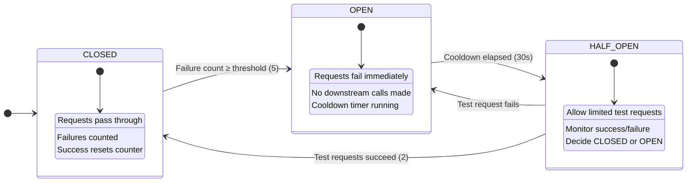
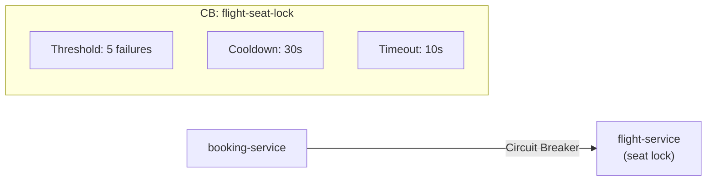
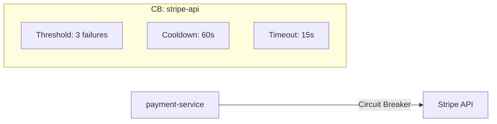
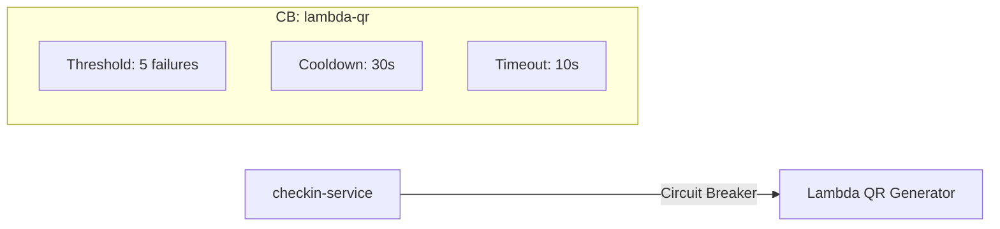
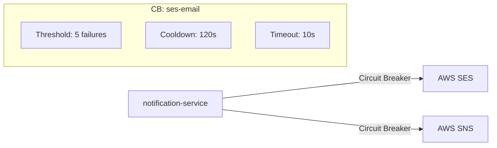
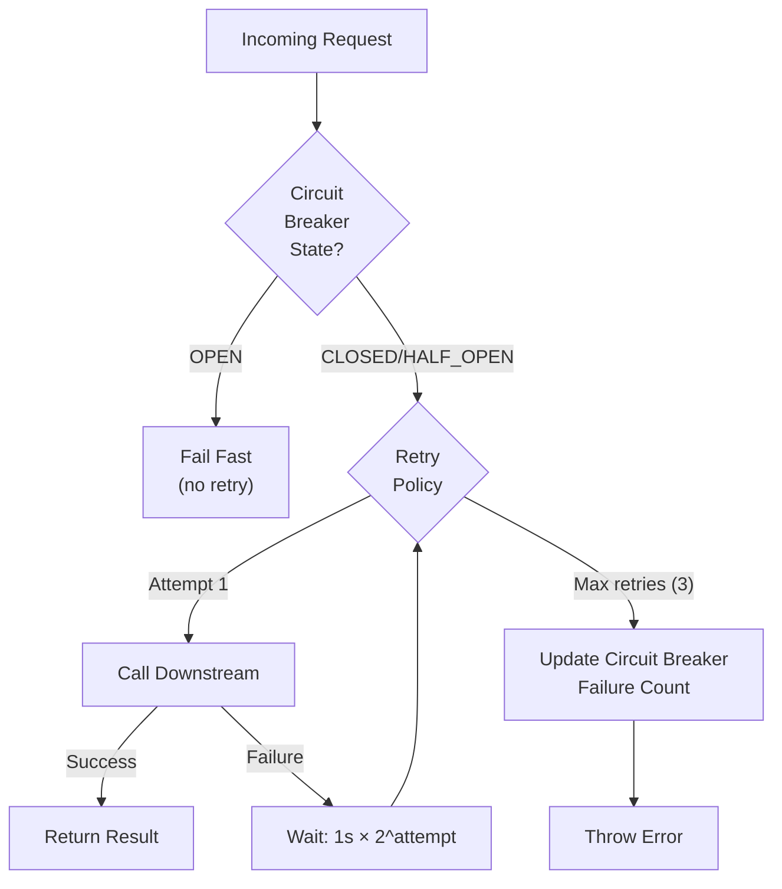
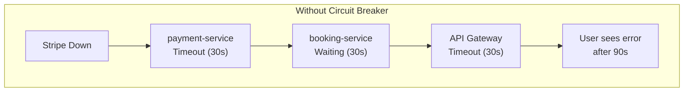
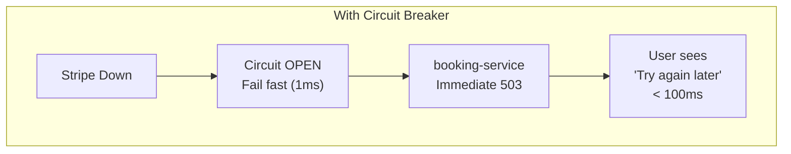

# AeroLink — Circuit Breaker Architecture

## Overview

AeroLink implements the **Circuit Breaker pattern** to prevent cascading failures across microservices. When a downstream dependency (e.g., Stripe API, AWS SES, flight-service) becomes unresponsive, the circuit breaker "trips" and immediately fails requests without attempting the call, allowing the failing service time to recover.

## Circuit Breaker State Machine



## Implementation

The circuit breaker is implemented as a shared utility in `@aerolink/common-middleware` (`packages/common-middleware/src/circuit-breaker.ts`) and can be reused across all services.

### Configuration Parameters

| Parameter | Default | Description |
|-----------|---------|-------------|
| `failureThreshold` | 5 | Consecutive failures before CLOSED → OPEN |
| `cooldownMs` | 30,000ms | Time in OPEN before testing (→ HALF_OPEN) |
| `timeoutMs` | 10,000ms | Request timeout (counts as failure) |
| `successThreshold` | 2 | Successful tests before HALF_OPEN → CLOSED |

### Usage Example

```typescript
import { CircuitBreakerFactory } from '@aerolink/common-middleware';

@Injectable()
export class PaymentsService {
  private readonly stripeCircuitBreaker = CircuitBreakerFactory.getOrCreate('stripe-api', {
    failureThreshold: 3,
    cooldownMs: 60_000,  // 1 minute cooldown for payment provider
    timeoutMs: 15_000,   // 15s timeout for Stripe calls
  });

  async chargeCard(amount: number, currency: string, token: string) {
    return this.stripeCircuitBreaker.execute(
      // Primary function
      () => this.stripe.charges.create({ amount, currency, source: token }),
      // Fallback when circuit is OPEN
      () => { throw new ServiceUnavailableException('Payment service temporarily unavailable'); },
    );
  }
}
```

## Per-Service Circuit Breaker Configuration

### booking-service



| Downstream | Circuit Name | Threshold | Cooldown | Timeout | Fallback |
|-----------|-------------|-----------|----------|---------|----------|
| flight-service (via Kafka) | `flight-seat-lock` | 5 | 30s | 10s | Cancel booking with reason |

### payment-service



| Downstream | Circuit Name | Threshold | Cooldown | Timeout | Fallback |
|-----------|-------------|-----------|----------|---------|----------|
| Stripe API | `stripe-api` | 3 | 60s | 15s | Queue for retry, return 503 |

### checkin-service



| Downstream | Circuit Name | Threshold | Cooldown | Timeout | Fallback |
|-----------|-------------|-----------|----------|---------|----------|
| Lambda QR | `lambda-qr` | 5 | 30s | 10s | Return text-only boarding pass |

### notification-service



| Downstream | Circuit Name | Threshold | Cooldown | Timeout | Fallback |
|-----------|-------------|-----------|----------|---------|----------|
| AWS SES | `ses-email` | 5 | 120s | 10s | Log notification, retry later |
| AWS SNS | `sns-sms` | 5 | 120s | 10s | Log notification, retry later |

## Retry Policy Integration

Circuit breakers work alongside **exponential backoff retry**:



### Retry Configuration

| Setting | Value | Rationale |
|---------|-------|-----------|
| Max retries | 3 | Enough for transient network issues |
| Base delay | 1,000ms | Start with 1 second |
| Max delay | 30,000ms | Cap at 30 seconds |
| Jitter | 20% | Prevent thundering herd |
| Backoff formula | `min(1000 × 2^attempt + jitter, 30000)` | Exponential with cap |

## Monitoring & Metrics

Circuit breaker metrics are exposed via the **Admin Dashboard** health endpoint:

```json
{
  "circuitBreakers": {
    "stripe-api": {
      "state": "CLOSED",
      "failureCount": 0,
      "totalRequests": 1523,
      "totalFailures": 12,
      "totalShortCircuits": 3,
      "lastFailureTime": "2026-06-04T10:23:45Z"
    },
    "ses-email": {
      "state": "HALF_OPEN",
      "failureCount": 5,
      "totalRequests": 892,
      "totalFailures": 47,
      "totalShortCircuits": 15,
      "lastFailureTime": "2026-06-04T10:30:12Z"
    }
  }
}
```

## Cascading Failure Prevention

Without circuit breakers, a failure in one service can cascade:




