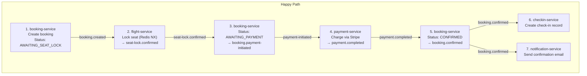
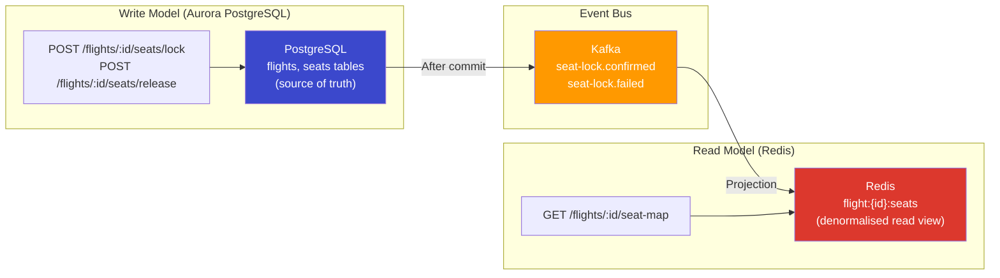
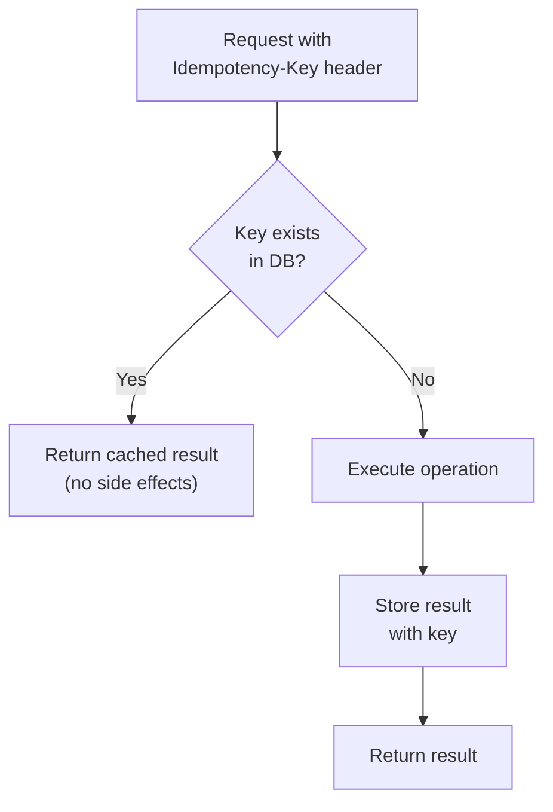

# AeroLink — Data Consistency in Distributed Systems

## Introduction

In a distributed microservices architecture like AeroLink, maintaining data consistency across service boundaries is one of the most critical and complex challenges. Each service owns its own database (Database-per-Service pattern), which means **traditional ACID transactions cannot span service boundaries**. This document thoroughly discusses the consistency challenges we face and justifies the patterns chosen.

## The CAP Theorem in AeroLink's Context

The **CAP theorem** states that a distributed system can guarantee at most two of three properties:
- **Consistency**: Every read receives the most recent write
- **Availability**: Every request receives a response
- **Partition Tolerance**: System continues despite network partitions

AeroLink's architecture prioritises **AP (Availability + Partition Tolerance)** with **eventual consistency**, because:

1. **Airline booking systems must be highly available** — a 2-minute downtime during peak booking hours can cost thousands of lost bookings
2. **Network partitions are inevitable** in multi-AZ deployments (AWS us-east-1a / us-east-1b)
3. **Strong consistency would require distributed locks** across services, creating coupling and latency that defeats the purpose of microservices

### Exception: Payment Processing

The payment-service uses **strong consistency within its own database boundary** because:
- Financial transactions must not be double-charged
- PCI DSS requires auditable, consistent payment records
- Stripe's API is naturally idempotent (using idempotency keys)

## Consistency Patterns Used

### 1. Saga Pattern (Choreography-Based)

**Why Saga over Two-Phase Commit (2PC)?**

| Factor | 2PC | Saga (Choreography) |
|--------|-----|---------------------|
| Availability | Blocks all participants during prepare phase | Non-blocking — each step is independent |
| Latency | High — requires lock acquisition across services | Low — async event-driven |
| Fault tolerance | Coordinator is SPOF | No single point of failure |
| Complexity | Simple to implement, hard to operate | Complex to implement, easy to operate |
| Compensation | Automatic rollback | Explicit compensating transactions |
| Database coupling | Requires XA-capable databases | Any database type works |

**AeroLink's Booking Saga — Choreography Flow:**



**Compensation (Unhappy) Paths:**

```mermaid
graph TD
    subgraph "Compensation Path: Seat Lock Failed"
        C1["booking.created → flight-service"]
        C2["Seat already taken"]
        C3["seat-lock.failed → booking-service"]
        C4["Status: CANCELLED<br/>Reason: SEAT_UNAVAILABLE"]
        C5["booking.cancelled → notification-service"]
        C6["Email: 'Sorry, seat taken'"]
    end

    C1 --> C2 --> C3 --> C4 --> C5 --> C6

    subgraph "Compensation Path: Payment Failed"
        P1["payment-initiated → payment-service"]
        P2["Stripe charge fails"]
        P3["payment.failed → booking-service"]
        P4["Status: COMPENSATING"]
        P5["booking.seat-released → flight-service"]
        P6["Release Redis seat lock"]
        P7["Status: CANCELLED<br/>Reason: PAYMENT_FAILED"]
    end

    P1 --> P2 --> P3 --> P4 --> P5 --> P6
    P4 --> P7
```



### Why Choreography over Orchestration?

We chose **choreography** (services react to events) over **orchestration** (a central saga manager directs steps) because:

1. **No SPOF** — no saga orchestrator service to fail
2. **Lower coupling** — services only know about events, not about each other
3. **Independent deployment** — adding a new step (e.g., loyalty points) only requires subscribing to `booking.confirmed`
4. **Kafka as the backbone** — provides durable, ordered event delivery that choreography needs
5. **Simpler scaling** — each consumer group scales independently

**Trade-off**: Choreography makes the saga flow harder to visualise and debug. We mitigate this with:
- **Correlation IDs** — every event carries a `correlationId` that traces the entire saga
- **Saga history** — booking-service stores a `sagaHistory` JSON array tracking every step
- **Distributed tracing** — OpenTelemetry X-Ray traces span the full saga

### 2. CQRS (Command Query Responsibility Segregation)

**Used in: flight-service (Seat Map)**

The flight-service implements CQRS for the seat map:



**Why CQRS for seats?**

- **Read-heavy workload** — seat maps are queried 100x more than updated
- **Low-latency reads** — Redis returns the full seat map in <5ms vs ~50ms from PostgreSQL
- **Real-time updates** — Kafka events update the Redis projection immediately after a seat lock
- **Eventual consistency acceptable** — a seat shown as "available" might be locked 100ms later; the booking saga handles the race

**Consistency window**: ~100-200ms between write commit and Redis projection update. This is acceptable because the seat-lock operation itself uses **Redis SET NX** (atomic compare-and-swap), so even if a stale read shows a seat as available, the lock will fail atomically.

### 3. Eventual Consistency

**Used in: All service boundaries**

The fundamental consistency model across AeroLink services is **eventual consistency**:

```
Service A writes to its DB → publishes event to Kafka → Service B consumes event → updates its DB
```

**Consistency guarantees by layer:**

| Layer | Consistency | Mechanism |
|-------|------------|-----------|
| Within a service | Strong (ACID) | PostgreSQL/DynamoDB transactions |
| Between services | Eventual (~100-500ms) | Kafka event propagation |
| Seat availability | Atomic lock | Redis SET NX (distributed lock) |
| Payment amount | Idempotent | Stripe idempotency keys |
| Booking status | Saga-consistent | sagaHistory audit trail |

### 4. Idempotency

Every write operation across AeroLink is idempotent to handle exactly-once semantics:



**Implementation per service:**

| Service | Idempotency Key | Storage |
|---------|----------------|---------|
| booking-service | `Idempotency-Key` header → `booking.idempotencyKey` | PostgreSQL unique index |
| payment-service | bookingId → Stripe idempotency key | Stripe API + PostgreSQL |
| baggage-service | `bagId + scanTimestamp` | DynamoDB conditional write |
| notification-service | `userId + eventType + eventId` | DynamoDB conditional write |

## Data Consistency Challenges & Mitigations

### Challenge 1: Out-of-Order Events

**Problem**: Kafka guarantees order within a partition, but if a service consumes from multiple partitions or topics, events may arrive out of order.

**Mitigation**: 
- Partition key = `bookingId` for all booking-related topics → all events for one booking go to the same partition
- Saga state machine validates transitions: e.g., `AWAITING_PAYMENT` can only follow `AWAITING_SEAT_LOCK`
- Invalid transitions are rejected and logged (not re-ordered)

### Challenge 2: Duplicate Events

**Problem**: Kafka provides "at least once" delivery. Network retries can cause duplicate events.

**Mitigation**:
- Every event has a unique `eventId` (UUID v4)
- Consumer deduplication: check if `eventId` was already processed (stored in saga history)
- Idempotent handlers: processing the same event twice has no additional effect

### Challenge 3: Lost Events

**Problem**: A service might crash after writing to its DB but before publishing the event.

**Mitigation**:
- **Transactional outbox pattern** (planned): Write event to an outbox table in the same DB transaction, then a background process publishes to Kafka
- **Current approach**: Write to DB → publish to Kafka → if publish fails, the booking saga stalls and a compensation timeout triggers after 5 minutes

### Challenge 4: Concurrent Seat Booking

**Problem**: Two passengers try to book the same seat simultaneously.

**Mitigation**:
```
Redis: SET flight:{id}:seat:{number}:lock {bookingId} NX EX 300
```
- `NX` = set only if not exists (atomic compare-and-swap)
- `EX 300` = 5-minute TTL (auto-release if saga fails)
- Only one booking succeeds; the other receives `seat-lock.failed`

### Challenge 5: Stale Read After Write

**Problem**: After confirming a booking, the user immediately queries their bookings and doesn't see it.

**Mitigation**:
- Write response includes the created/updated entity → frontend updates optimistically
- Polling with short interval (2s) for status updates
- WebSocket push for real-time seat map changes

## Consistency vs Availability Trade-off Matrix

| Scenario | Consistency Level | Availability Impact | Justification |
|----------|------------------|--------------------|----|
| Flight search | Eventual (minutes) | None | Price/availability can be slightly stale |
| Seat selection | Strong (Redis NX) | Minimal | Must prevent double-booking |
| Payment charge | Strong (Stripe) | Low (Stripe SLA) | Must not double-charge |
| Booking status | Eventual (ms) | None | Saga updates within seconds |
| Baggage tracking | Eventual (seconds) | None | Real-time scan updates |
| Admin dashboard | Eventual (seconds) | None | Monitoring data |
| User profile | Strong (within service) | None | Single service owns data |

## Conclusion

AeroLink uses a **pragmatic mix of consistency patterns**:

1. **Strong consistency** within each service's database boundary (ACID)
2. **Eventual consistency** across service boundaries (Kafka events)
3. **Choreography Saga** for multi-service transactions (booking flow)
4. **CQRS** for read-heavy, latency-sensitive queries (seat maps)
5. **Idempotency** at every write boundary (exactly-once semantics)
6. **Distributed locks** for contested resources (Redis SET NX for seats)

This approach prioritises **availability and partition tolerance** (AP in CAP) while keeping the consistency window small enough (<500ms) that users perceive the system as consistent. The Saga pattern with compensating transactions ensures that even in failure scenarios, the system eventually reaches a consistent state.
