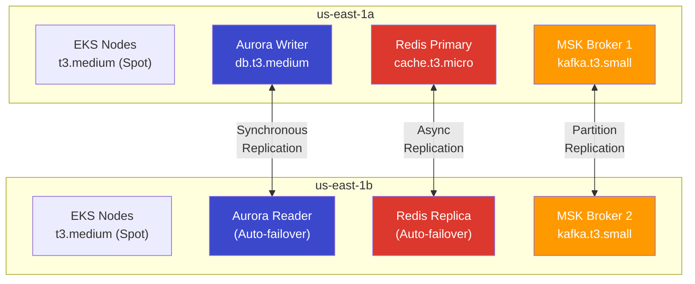
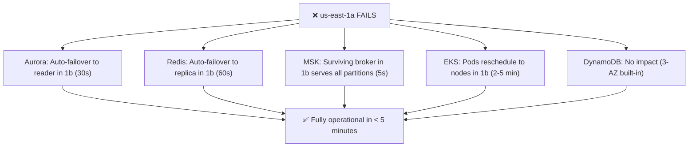
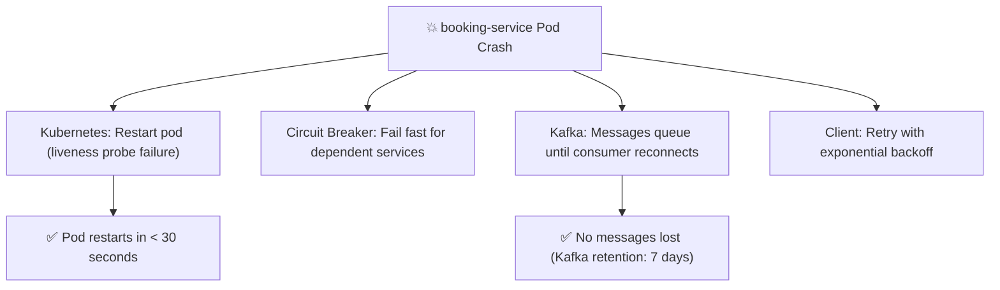
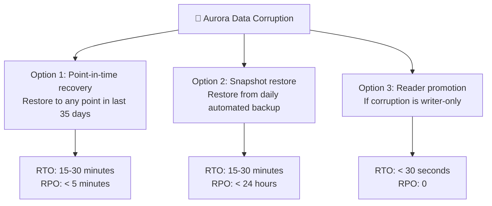
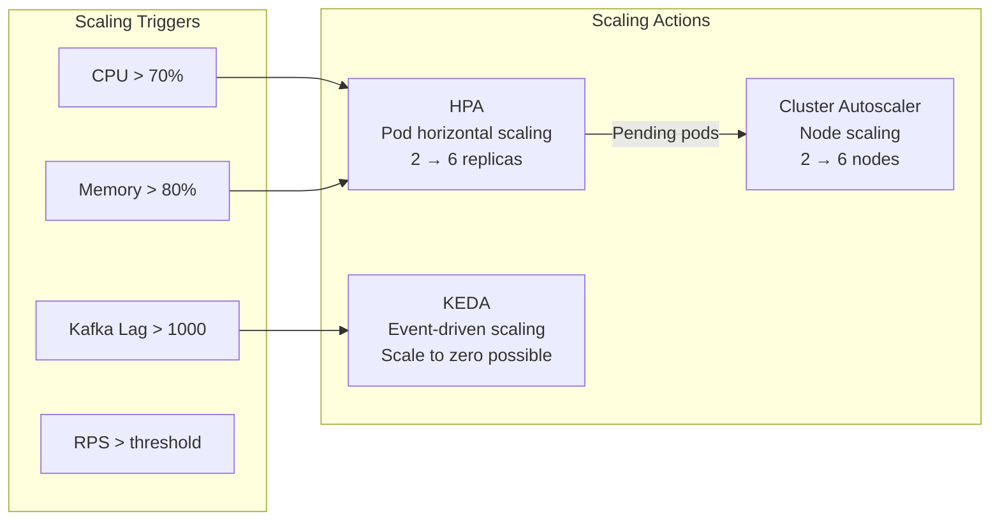

# AeroLink — Disaster Recovery & High Availability Strategy

## High Availability Architecture

AeroLink achieves high availability through **multi-AZ deployment** across `us-east-1a` and `us-east-1b`, with every stateful component replicated across availability zones.

## Component-Level HA Strategy

### 1. EKS Cluster (Compute)

| Feature | Configuration |
|---------|--------------|
| Node distribution | Managed node group spans 2 AZs |
| Capacity type | Spot instances (cost-efficient + auto-replacement) |
| Min/Max nodes | 2–6 nodes (Cluster Autoscaler manages) |
| Pod redundancy | Each service: `minReplicas: 2`, anti-affinity across AZs |
| PDB | `minAvailable: 1` — at least 1 pod always running during disruptions |
| Rolling updates | `maxUnavailable: 1` — one pod at a time |
| Health checks | Liveness + readiness probes with 15s/20s initial delay |

**Failure scenario**: If one AZ loses all nodes, the Cluster Autoscaler provisions new Spot instances in the remaining AZ within 2–5 minutes. PodDisruptionBudgets ensure at least one replica stays running.

### 2. Aurora PostgreSQL (Primary Database)

| Feature | Configuration |
|---------|--------------|
| Deployment | Multi-AZ (1 writer in 1a, 1 reader in 1b) |
| Failover | Automatic (~30 seconds) |
| Replication | Synchronous storage replication |
| Backup | Automated daily snapshots (35-day retention) |
| Point-in-time recovery | Up to 5-minute granularity |
| Encryption | At rest with KMS CMK (cmk-pii) |
| Connection pooling | PgBouncer sidecar in each service pod |

**Failure scenario**: If the writer node fails, Aurora automatically promotes the reader to writer in ~30 seconds. The new writer endpoint resolves through the same DNS name. Applications experience a brief connection reset but reconnect automatically.

### 3. ElastiCache Redis (Cache + CQRS Read Model)

| Feature | Configuration |
|---------|--------------|
| Cluster mode | Replication group with 1 primary + 1 replica |
| Multi-AZ | Primary in 1a, replica in 1b |
| Failover | Automatic (< 60 seconds) |
| Encryption | In transit (TLS) + at rest (KMS cmk-pii) |
| Backup | Daily snapshots (7-day retention) |

**Failure scenario**: If Redis primary fails, ElastiCache promotes the replica within 60 seconds. The CQRS seat map projection rebuilds from the latest Kafka events (stateless — no data loss since PostgreSQL is the source of truth).

### 4. Amazon MSK (Kafka)

| Feature | Configuration |
|---------|--------------|
| Brokers | 2 brokers across 2 AZs |
| Replication factor | 2 (every partition has a copy in each AZ) |
| Min ISR | 2 (for topics with RF=2, this means both replicas must acknowledge) |
| Storage | 100GB EBS per broker |
| Retention | 7 days (168 hours) |
| Unclean leader election | Disabled (prevents data loss) |
| Monitoring | JMX + Node exporter (Prometheus-compatible) |

**Failure scenario**: If one broker fails, the surviving broker has complete copies of all partitions and continues serving. Producer retries handle the brief leader election (~5 seconds). Consumer group rebalances in ~10 seconds.

### 5. DynamoDB (Baggage + Notifications)

| Feature | Configuration |
|---------|--------------|
| Replication | Automatic 3-AZ replication (built-in) |
| Availability | 99.999% SLA |
| Backup | Point-in-time recovery (35-day retention) |
| Encryption | At rest with KMS CMK (cmk-pii) |
| Capacity | On-demand (auto-scaling) |

**Failure scenario**: DynamoDB is inherently multi-AZ. No manual failover needed. AWS handles replication automatically.

## RTO/RPO Targets

| Component | RPO (Data Loss) | RTO (Downtime) | Mechanism |
|-----------|-----------------|----------------|-----------|
| Aurora PostgreSQL | 0 (synchronous replication) | < 30 seconds | Auto-failover |
| ElastiCache Redis | < 1 second (async replication) | < 60 seconds | Auto-failover |
| Amazon MSK | 0 (synchronous RF=2) | < 10 seconds | Leader election |
| DynamoDB | 0 (synchronous 3-AZ) | 0 (no failover needed) | Built-in |
| EKS Services | 0 (stateless pods) | < 5 minutes | Autoscaler + Spot replacement |
| **Overall System** | **< 1 second** | **< 5 minutes** | All components |

## Disaster Recovery Scenarios

### Scenario 1: Single AZ Failure

### Scenario 2: Service Crash

### Scenario 3: Database Corruption

### Scenario 4: Complete Region Failure (DR)

For a full `us-east-1` failure, AeroLink's Terraform-based IaC enables rapid re-deployment:

1. Update `terraform.tfvars` → change `aws_region` to `us-west-2`
2. `terraform init && terraform apply` → creates entire infrastructure in new region (~25 min)
3. Restore Aurora from cross-region backup (if configured)
4. Push Docker images to new ECR
5. ArgoCD syncs services automatically

**Recovery time: ~45-60 minutes** (acceptable for a non-critical demo environment)

## Auto-Scaling Strategy

### Per-Service Scaling Configuration

| Service | Scale Trigger | Min Pods | Max Pods | Scale Type |
|---------|--------------|----------|----------|------------|
| identity-service | CPU > 70% | 2 | 6 | HPA |
| flight-service | CPU > 70% | 2 | 6 | HPA |
| booking-service | CPU > 70% | 2 | 6 | HPA |
| payment-service | CPU > 70% | 2 | 4 | HPA |
| checkin-service | CPU > 70% | 2 | 6 | HPA |
| baggage-service | Kafka lag | 2 | 6 | KEDA |
| notification-service | Kafka lag | 2 | 6 | KEDA |
| webui | CPU > 70% | 2 | 4 | HPA |

## CloudWatch Alarms

| Alarm | Threshold | Action |
|-------|-----------|--------|
| EKS CPU utilization | > 70% for 5 min | SNS → email alert |
| API Gateway 5xx rate | > 5% for 2 min | SNS → email alert |
| API Gateway latency | p95 > 2 seconds | SNS → email alert |
| Aurora CPU | > 80% for 5 min | SNS → email alert |
| Aurora connections | > 80% max | SNS → email alert |
| MSK disk usage | > 80% | SNS → email alert |
| Kafka consumer lag | > 10,000 messages | SNS → email alert |

## Backup Strategy

| Component | Backup Type | Frequency | Retention | Cross-Region |
|-----------|------------|-----------|-----------|--------------|
| Aurora | Automated snapshot | Daily | 35 days | Optional |
| Aurora | Point-in-time | Continuous | 35 days | No |
| ElastiCache | Snapshot | Daily | 7 days | No |
| DynamoDB | PITR | Continuous | 35 days | No |
| MSK | Log retention | Continuous | 7 days | No |
| CloudTrail | Log archival | Continuous | 7 years (Glacier) | Yes |
| Terraform state | S3 versioning | On change | 30 days | No |

## Security During DR

- **KMS keys**: Region-specific — new keys created in DR region
- **Secrets Manager**: Secrets must be re-created in DR region
- **Cognito**: User pool must be migrated (import/export users)
- **Route 53**: Update DNS records to point to new region (< 60s TTL)
- **ACM**: New certificate issued and validated in DR region
