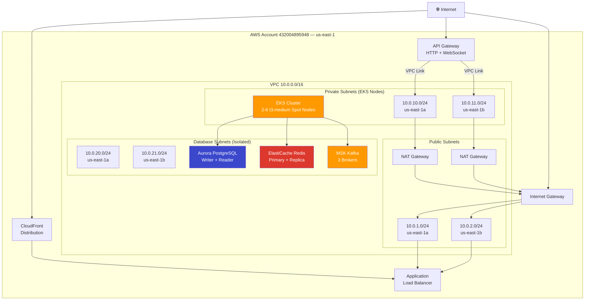
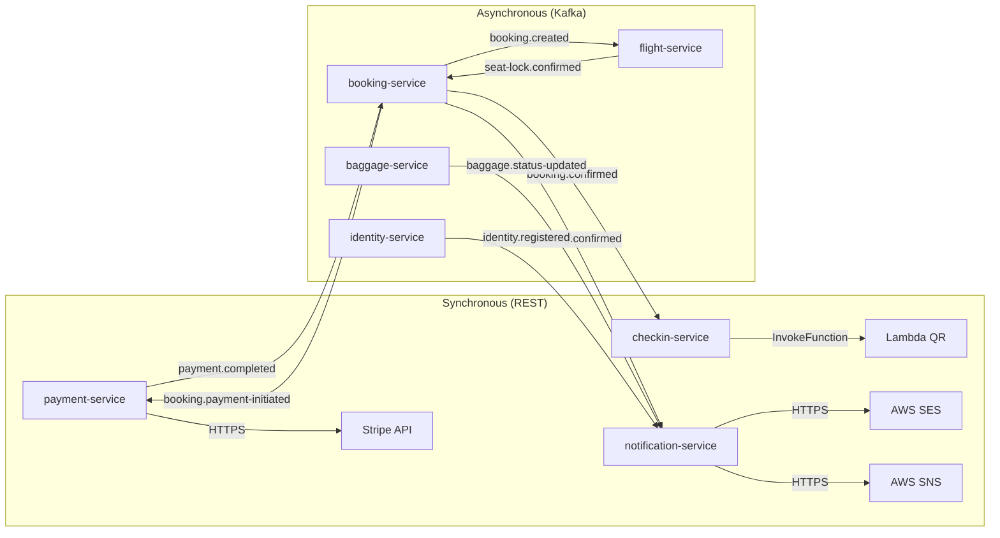
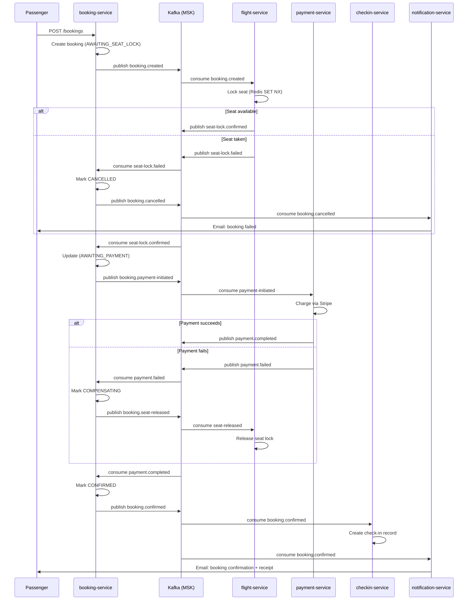

# AeroLink — High-Level System Architecture

## System Architecture Overview

```mermaid
graph TB
    subgraph "Client Layer"
        Browser["🌐 Browser / Mobile"]
    end

    subgraph "Edge Layer (AWS)"
        CF["☁️ CloudFront CDN<br/>TLS 1.3 + WAF"]
        APIGW["🔌 API Gateway (HTTP)<br/>JWT Auth + Rate Limiting"]
        WSGW["📡 WebSocket Gateway<br/>Real-time Events"]
    end

    subgraph "DNS & Certificates"
        R53["📌 Route 53<br/>transnova.online"]
        ACM["🔒 ACM Certificates<br/>*.transnova.online"]
    end

    subgraph "Compute Layer — EKS Cluster"
        ALB["⚖️ Application Load Balancer"]
        
        subgraph "Service Mesh (Kubernetes Pods)"
            IS["👤 identity-service<br/>Auth + RBAC"]
            FS["✈️ flight-service<br/>Flights + CQRS Seats"]
            BS["📋 booking-service<br/>Saga Orchestration"]
            PS["💳 payment-service<br/>Stripe + PCI"]
            CS["✅ checkin-service<br/>Boarding Pass + QR"]
            BgS["🧳 baggage-service<br/>7-State FSM"]
            NS["📧 notification-service<br/>SES + SNS"]
            WUI["🖥️ webui<br/>React 19 + Vite"]
        end

        subgraph "Platform Components"
            ARGO["🔄 Argo CD<br/>GitOps Sync"]
            ESO["🔑 External Secrets<br/>Operator"]
            FB["📋 Fluent Bit<br/>Log Shipping"]
            OTEL["📊 OpenTelemetry<br/>Distributed Tracing"]
            CA["📈 Cluster Autoscaler"]
            KEDA["⚡ KEDA<br/>Event-Driven Scaling"]
            MS["📏 Metrics Server"]
        end
    end

    subgraph "Data Layer"
        Aurora["🐘 Aurora PostgreSQL<br/>Multi-AZ (Writer + Reader)<br/>5 Databases"]
        Redis["⚡ ElastiCache Redis<br/>Multi-AZ<br/>CQRS Read Model + Session Cache"]
        DDB["📦 DynamoDB<br/>Baggage + Notifications"]
        MSK["📨 Amazon MSK (Kafka)<br/>3 Brokers, 15 Topics<br/>TLS + SASL/IAM"]
    end

    subgraph "Serverless"
        Lambda["⚡ Lambda QR<br/>QR Code + Barcode Generator"]
    end

    subgraph "Security & Compliance"
        KMS["🔐 KMS<br/>3 CMKs: PCI, PII, Infra"]
        SM["🗝️ Secrets Manager<br/>DB URLs, JWT, Stripe"]
        Cognito["👥 Cognito<br/>User Pool + OAuth 2.0"]
        WAF2["🛡️ WAF v2<br/>Managed Rules"]
        GD["🔍 GuardDuty<br/>Threat Detection"]
        CT["📜 CloudTrail<br/>Audit Logging"]
    end

    subgraph "Observability"
        CW["📊 CloudWatch<br/>Logs + Metrics + Alarms"]
        XRAY["🔎 X-Ray<br/>Distributed Traces"]
        SNS2["📬 SNS<br/>Alert Notifications"]
    end

    Browser -->|"HTTPS"| CF
    Browser -->|"WSS"| WSGW
    CF -->|"Origin"| ALB
    CF -.->|"DNS"| R53
    APIGW -->|"VPC Link"| ALB
    WSGW -->|"VPC Link"| ALB

    ALB --> IS & FS & BS & PS & CS & BgS & NS & WUI

    IS --> Aurora
    IS --> Cognito
    FS --> Aurora & Redis
    BS --> Aurora
    PS --> Aurora
    CS --> Aurora & Lambda
    BgS --> DDB
    NS --> DDB

    IS & FS & BS & PS & CS & BgS & NS <-->|"Kafka Events"| MSK

    ESO --> SM
    SM --> KMS

    FB --> CW
    OTEL --> XRAY
    CW --> SNS2

    style CF fill:#ff9900,color:#fff
    style APIGW fill:#ff9900,color:#fff
    style ALB fill:#ff9900,color:#fff
    style Aurora fill:#3b48cc,color:#fff
    style Redis fill:#dc382d,color:#fff
    style MSK fill:#ff9900,color:#fff
    style Lambda fill:#ff9900,color:#fff
    style KMS fill:#dd3333,color:#fff
    style Cognito fill:#ff9900,color:#fff
```

## AWS Infrastructure Diagram

## Network Security Groups

| Security Group | Inbound | Source | Purpose |
|---------------|---------|--------|---------|
| `eks-cluster-sg` | 443 | API server | Control plane communication |
| `eks-node-sg` | All | Self | Pod-to-pod communication |
| `eks-node-sg` | 1025-65535 | `eks-cluster-sg` | Control plane → nodes |
| `msk-sg` | 9098 | `eks-node-sg` | Kafka TLS from EKS |
| `aurora-sg` | 5432 | `eks-node-sg` | PostgreSQL from EKS |
| `redis-sg` | 6379 | `eks-node-sg` | Redis from EKS |
| `apigw-sg` | All outbound | `0.0.0.0/0` | API Gateway VPC Link |

## Service Communication Matrix

## Data Flow — Booking Saga

