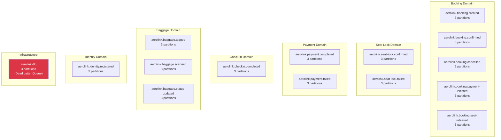
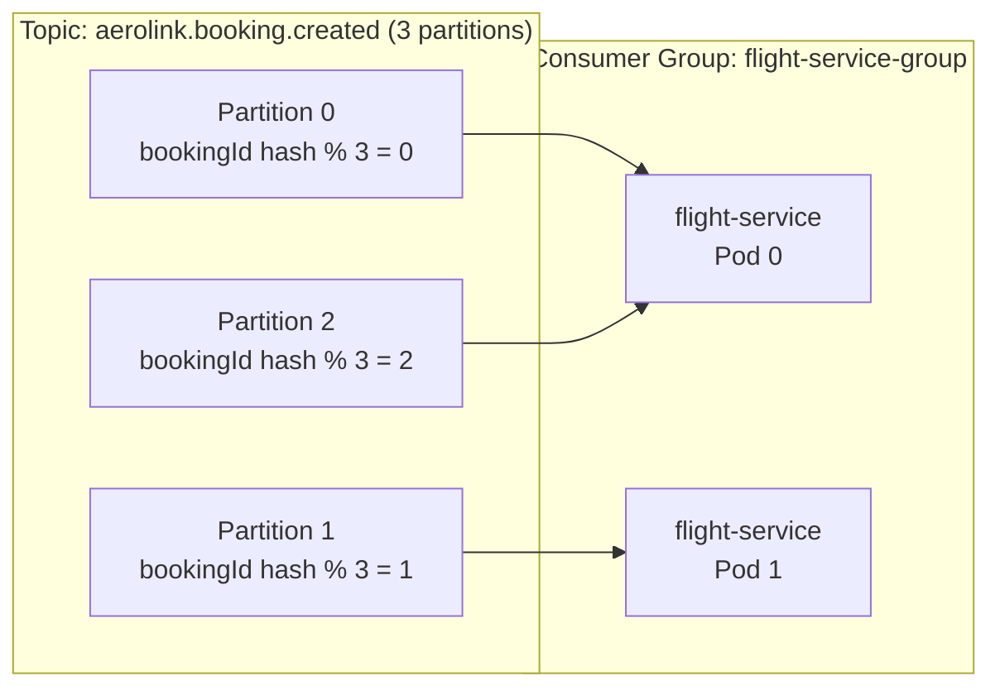
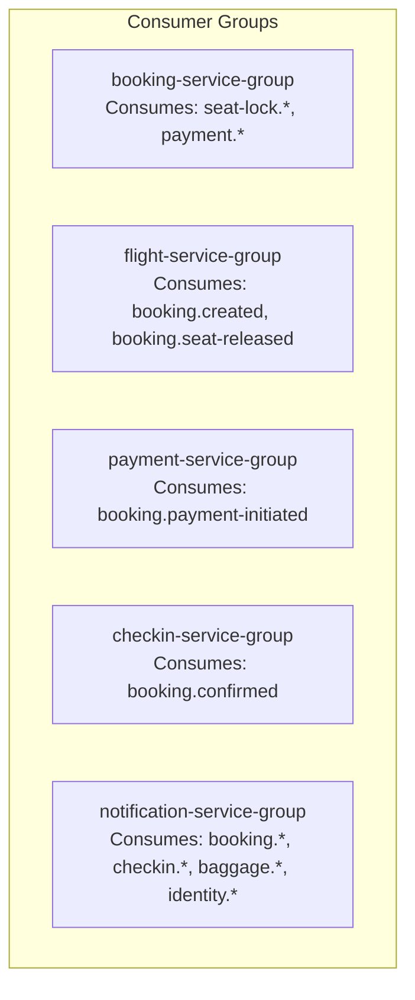
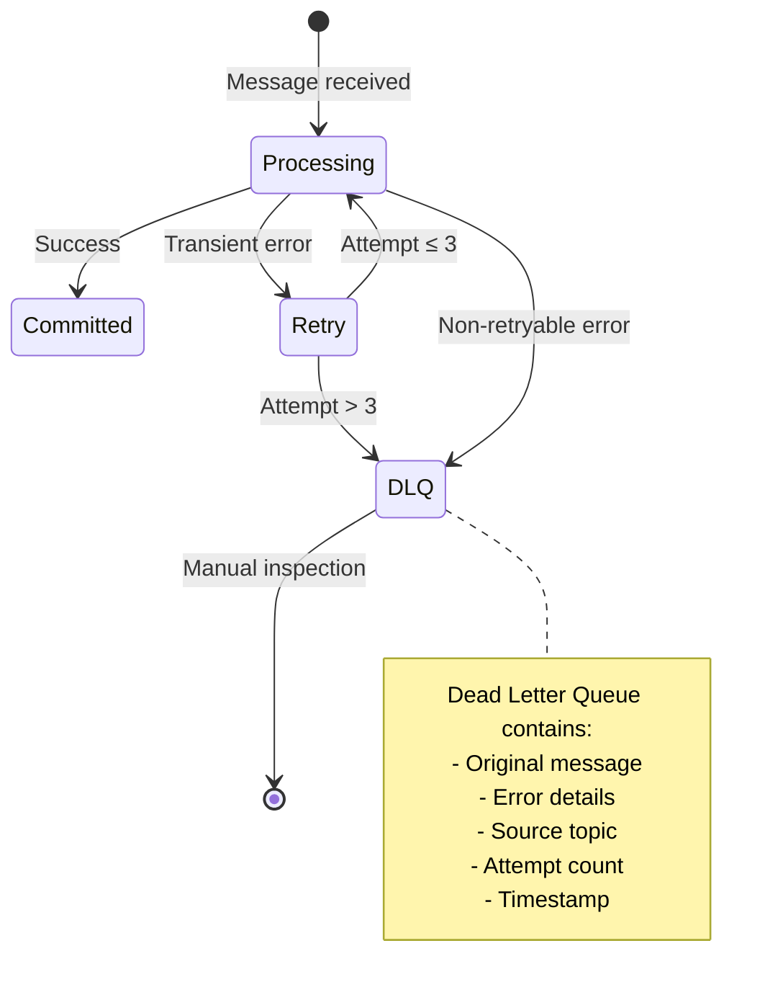
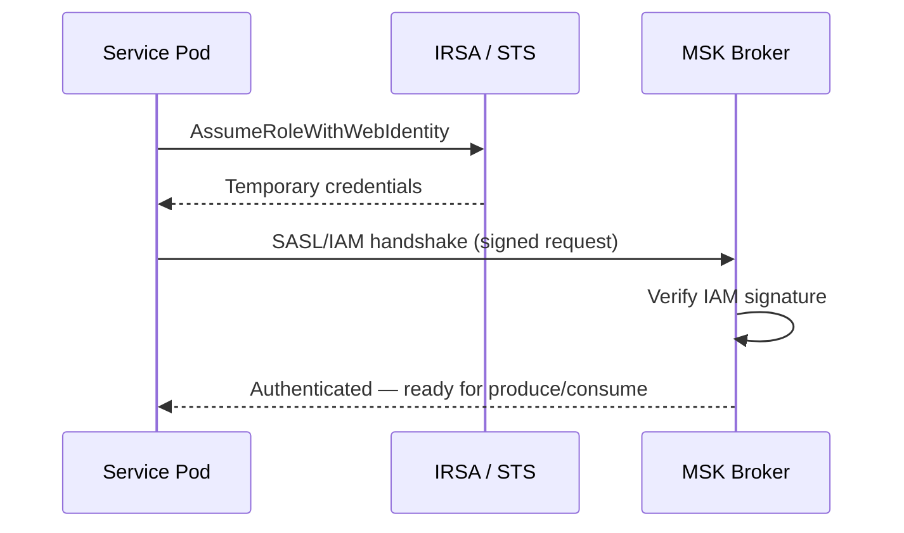

# AeroLink — Kafka Event-Driven Architecture

## Overview

AeroLink uses **Amazon MSK (Managed Streaming for Apache Kafka)** as the backbone for inter-service communication. The architecture follows an **event-driven choreography pattern** where services publish domain events and subscribe to events they're interested in, without a central orchestrator.

## Why Kafka?

| Requirement | How Kafka Addresses It |
|------------|----------------------|
| Decoupled services | Producers don't need to know about consumers |
| Reliable delivery | Replicated partitions with configurable durability |
| Event replay | Consumers can re-read events from any offset |
| Ordered processing | Per-partition ordering guarantees |
| Back-pressure | Consumer groups auto-balance and lag management |
| Real-time sync | Sub-second latency for event propagation |

## MSK Cluster Configuration

```
Cluster: aerolink-dev-kafka
Region:  us-east-1
Brokers: 2 (one per AZ: us-east-1a, us-east-1b)
Instance Type: kafka.t3.small
Storage: 100GB EBS per broker

Authentication: SASL/IAM (AWS IAM-based, no passwords)
Encryption In Transit: TLS (client ↔ broker, broker ↔ broker)
Encryption At Rest: KMS CMK (cmk-pii)
Auto-create topics: DISABLED (topics created by application on startup)
```

## Topic Architecture

### Topic Naming Convention
```
aerolink.{domain}.{event-name}
```

### All 15 Topics



### Topic → Producer → Consumer Matrix

| Topic | Partition Key | Producer | Consumers | Purpose |
|-------|--------------|----------|-----------|---------|
| `booking.created` | bookingId | booking-service | flight-service | Trigger seat lock |
| `booking.confirmed` | bookingId | booking-service | checkin-service, notification-service | Enable check-in, send confirmation |
| `booking.cancelled` | bookingId | booking-service | notification-service, flight-service | Notify, release seat |
| `booking.payment-initiated` | bookingId | booking-service | payment-service | Trigger Stripe charge |
| `booking.seat-released` | bookingId | booking-service | flight-service | Release locked seat |
| `seat-lock.confirmed` | bookingId | flight-service | booking-service | Advance saga |
| `seat-lock.failed` | bookingId | flight-service | booking-service | Compensate saga |
| `payment.completed` | bookingId | payment-service | booking-service | Advance saga |
| `payment.failed` | bookingId | payment-service | booking-service | Compensate saga |
| `checkin.completed` | bookingId | checkin-service | notification-service | Send boarding pass |
| `baggage.tagged` | bookingId | baggage-service | notification-service | Bag tag confirmation |
| `baggage.scanned` | bagId | baggage-service | — (audit only) | Location tracking |
| `baggage.status-updated` | bagId | baggage-service | notification-service | Status change alert |
| `identity.registered` | userId | identity-service | notification-service | Welcome email |
| `dlq` | originalTopic | all (on failure) | monitoring | Dead letters for inspection |

## Partition Strategy

Each topic uses **3 partitions** with the following rationale:

1. **Partition Key = bookingId** for booking-related topics ensures all events for a single booking are processed in order by the same consumer instance
2. **3 partitions** allows up to 3 concurrent consumers per consumer group
3. **Replication factor = 2** (min of broker count and 3) ensures fault tolerance with 2 brokers



## Consumer Group Architecture



## Event Schema Contract

All events follow a standardized envelope defined in `@aerolink/events`:

```typescript
interface EventEnvelope<T> {
  eventId: string;        // UUID v4 — unique per event
  eventType: string;      // e.g. 'BookingCreated'
  occurredAt: string;     // ISO 8601 timestamp
  correlationId: string;  // Traces the request across services
  version: number;        // Schema version for evolution
  payload: T;             // Domain-specific payload
}
```

Events are validated at both **producer and consumer** using **Zod schemas** from the `@aerolink/events` package. This ensures:
- Schema evolution is explicit (version field)
- Invalid events are caught before publishing
- Consumers reject malformed events to the DLQ

## Error Handling & Dead Letter Queue



### Retry Policy per Consumer
- **Max retries**: 3
- **Backoff**: Exponential (1s, 2s, 4s)
- **Non-retryable errors**: Validation failures, duplicate events
- **DLQ topic**: `aerolink.dlq`

## SASL/IAM Authentication

MSK uses **SASL/IAM** authentication, which means:
- No Kafka usernames/passwords needed
- Each service pod assumes its **IRSA (IAM Role for Service Accounts)** role
- The IAM role grants `kafka-cluster:*` permissions scoped to the MSK cluster
- Authentication tokens are auto-rotated by the `aws-msk-iam-sasl-signer-js` library



## Performance Characteristics

| Metric | Value |
|--------|-------|
| End-to-end latency (produce → consume) | ~50-200ms |
| Max throughput per partition | ~1MB/s |
| Retention period | 7 days (168 hours) |
| Consumer lag alert threshold | > 1000 messages |
| Replication factor | 2 |
| In-sync replicas minimum | 2 (if 2+ brokers) |
| Unclean leader election | Disabled (data safety) |
