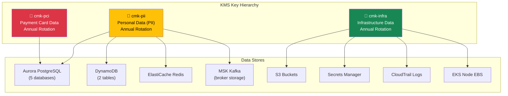
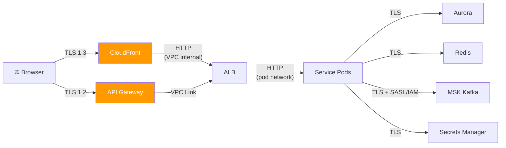
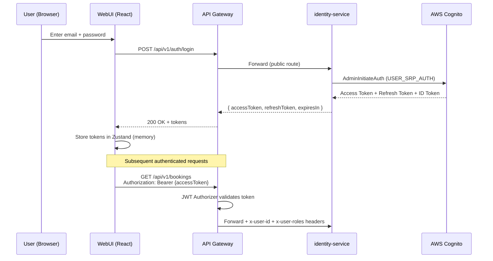
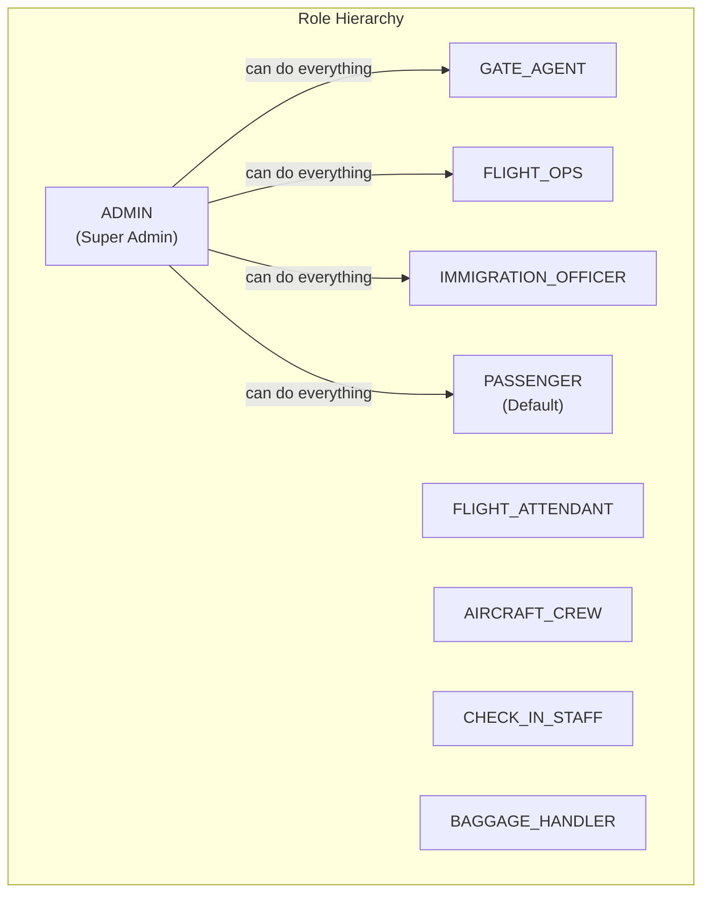
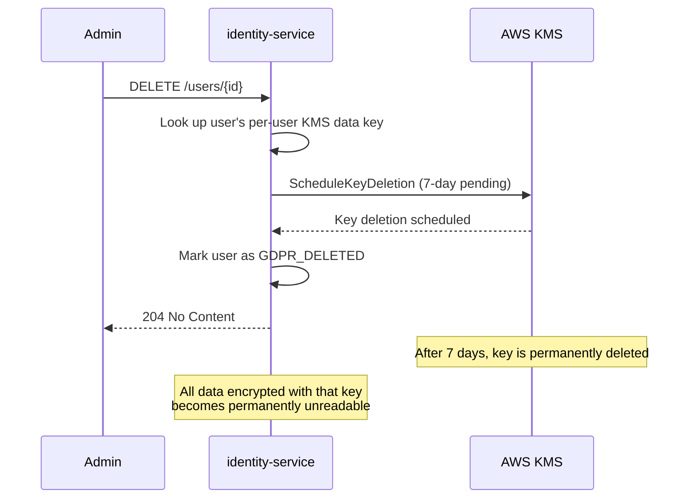
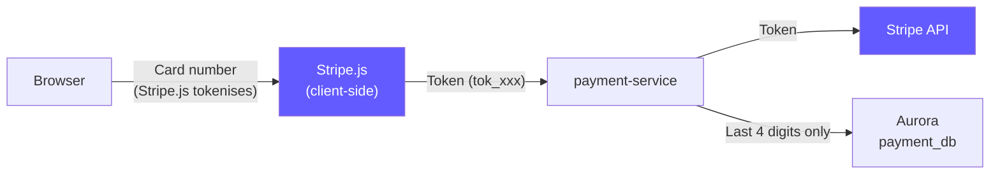
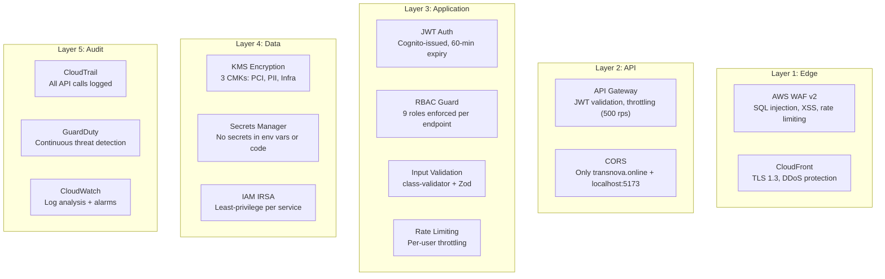

# AeroLink — Security & Compliance Architecture

## Encryption Architecture

### Encryption at Rest

All data at rest is encrypted using **AWS KMS Customer Managed Keys (CMKs)** with key separation by data classification:

| Data Store | KMS Key | Encryption Type | Algorithm |
|-----------|---------|----------------|-----------|
| Aurora PostgreSQL (payment_db) | cmk-pci | Server-side | AES-256 |
| Aurora PostgreSQL (others) | cmk-pii | Server-side | AES-256 |
| DynamoDB (baggage, notifications) | cmk-pii | Server-side | AES-256 |
| ElastiCache Redis | cmk-pii | Server-side | AES-256 |
| MSK Kafka (broker disk) | cmk-pii | Server-side | AES-256 |
| S3 (CloudFront logs, CloudTrail) | cmk-infra | Server-side | AES-256 |
| EKS Secrets (etcd) | cmk-infra | Envelope encryption | AES-256 |
| Secrets Manager | cmk-pci / cmk-pii | Envelope encryption | AES-256 |

### Encryption in Transit

All network communication uses **TLS 1.2+** (CloudFront uses TLS 1.3):

| Connection | Protocol | Minimum Version |
|-----------|----------|----------------|
| Browser → CloudFront | TLS | 1.3 |
| Browser → API Gateway | TLS | 1.2 |
| API Gateway → ALB (VPC Link) | HTTP | N/A (VPC internal) |
| ALB → Service Pods | HTTP | N/A (cluster network) |
| Service → Aurora PostgreSQL | TLS | 1.2 |
| Service → ElastiCache Redis | TLS | 1.2 |
| Service → MSK Kafka | TLS + SASL/IAM | 1.2 |
| Service → Secrets Manager | TLS | 1.2 |
| Service → Lambda QR | TLS (AWS SDK) | 1.2 |

## Authentication & Authorisation (OAuth 2.0)

### Authentication Flow

### Token Configuration

| Token | Validity | Storage | Rotation |
|-------|----------|---------|----------|
| Access Token | 60 minutes | Memory (Zustand) | Auto-refresh |
| Refresh Token | 30 days | Memory (Zustand) | On use |
| ID Token | 60 minutes | Not stored | Via Cognito |

### RBAC — Role-Based Access Control

AeroLink implements **9 roles** enforced at two levels:

1. **API Gateway level**: JWT claim `custom:roles` checked by Cognito JWT Authorizer
2. **Service level**: `@Roles()` decorator + `RolesGuard` in NestJS

### Permission Matrix

| Resource | PASSENGER | GATE_AGENT | FLIGHT_OPS | IMMIGRATION | ADMIN |
|----------|-----------|------------|------------|-------------|-------|
| Search flights | ✅ | ✅ | ✅ | ✅ | ✅ |
| Book flight | ✅ | ❌ | ❌ | ❌ | ✅ |
| View own bookings | ✅ | ❌ | ❌ | ❌ | ✅ |
| Web check-in | ✅ | ❌ | ❌ | ❌ | ✅ |
| Track own baggage | ✅ | ❌ | ❌ | ❌ | ✅ |
| Board passengers | ❌ | ✅ | ❌ | ❌ | ✅ |
| Update flight status | ❌ | ❌ | ✅ | ❌ | ✅ |
| Immigration clearance | ❌ | ❌ | ❌ | ✅ | ✅ |
| Manage users | ❌ | ❌ | ❌ | ❌ | ✅ |
| View all bookings | ❌ | ❌ | ❌ | ❌ | ✅ |
| Service health | ❌ | ❌ | ❌ | ❌ | ✅ |
| Assign roles | ❌ | ❌ | ❌ | ❌ | ✅ |

## GDPR Compliance

### Data Subject Rights Implementation

| Right | Implementation |
|-------|---------------|
| **Right to Access** | `GET /users/{id}` — returns all stored personal data |
| **Right to Rectification** | `PUT /users/{id}` — update personal data |
| **Right to Erasure** | `DELETE /users/{id}` — cryptographic shredding via KMS |
| **Right to Portability** | `GET /users/{id}/export` — JSON export of all data |
| **Right to Restriction** | `PATCH /users/{id}/restrict` — flag account as restricted |

### Cryptographic Shredding (Right to Erasure)

Instead of deleting data from every service database (which risks missed records in a microservices architecture), AeroLink uses **cryptographic shredding**:

**How it works**: Each user's PII is encrypted with a unique data encryption key (DEK) derived from the KMS CMK. When the user requests deletion, we schedule the DEK for deletion. After the 7-day cooling-off period, the key is permanently destroyed and all associated PII becomes cryptographically irrecoverable.

## PCI DSS Compliance

### Cardholder Data Handling

| PCI DSS Requirement | AeroLink Implementation |
|--------------------|------------------------|
| Never store full card number | Stripe.js tokenises on client — server never sees PAN |
| Encrypt cardholder data | KMS CMK (cmk-pci) encrypts payment_db at rest |
| Restrict access to cardholder data | IRSA role for payment-service only — no other service can access cmk-pci |
| Log and monitor all access | CloudTrail logs all KMS decrypt operations |
| Regularly test security | GuardDuty continuous threat detection |
| Maintain security policy | ADR-007 documents security decisions |

### Data Stored vs Not Stored

| Data | Stored? | Where | Encrypted With |
|------|---------|-------|----------------|
| Full card number (PAN) | ❌ Never | — | — |
| Card expiry | ❌ Never | — | — |
| CVV | ❌ Never | — | — |
| Last 4 digits | ✅ | Aurora payment_db | cmk-pci |
| Stripe charge ID | ✅ | Aurora payment_db | cmk-pci |
| Transaction amount | ✅ | Aurora payment_db | cmk-pci |

## Security Layers

## Container Security

| Control | Implementation |
|---------|---------------|
| Non-root user | All containers run as UID 1000 |
| Read-only filesystem | `readOnlyRootFilesystem: true` |
| Drop capabilities | `drop: ALL` — no Linux capabilities |
| IMDSv2 only | Instance metadata requires session token |
| Image scanning | ECR image scanning on push |
| Network policy | Kubernetes NetworkPolicy restricts pod-to-pod |

## Threat Detection (GuardDuty)

Amazon GuardDuty is enabled for continuous monitoring:

| Detection Type | What It Monitors |
|---------------|-----------------|
| EKS Audit Log Analysis | Suspicious Kubernetes API calls |
| S3 Protection | Unusual data access patterns |
| Malware Protection | Scans EBS volumes for malware |
| Runtime Monitoring | Container-level threat detection |

Findings are forwarded to **SNS → email** for immediate notification.
