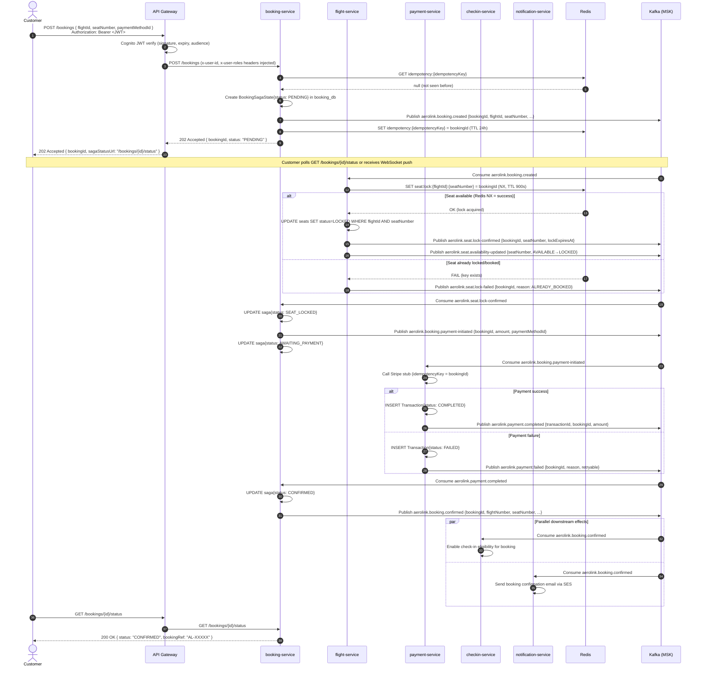
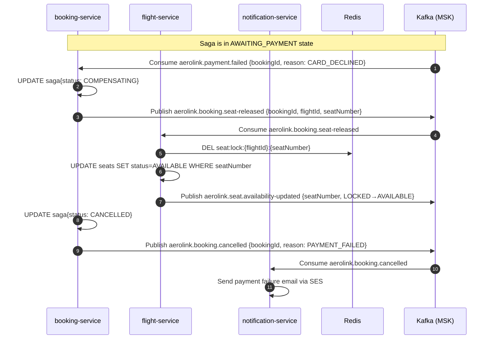
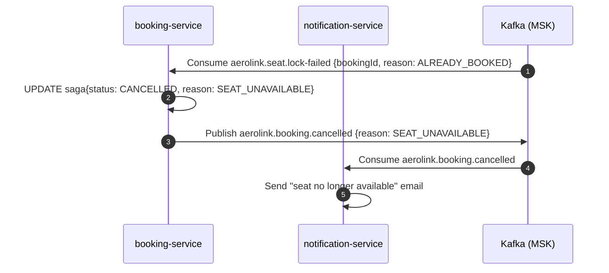

# Sequence Diagram — Booking Saga (Choreography)

## Happy Path



---

## Compensation Path — Payment Failure



---

## Compensation Path — Seat Lock Failure



---

## Saga State Transitions

```
PENDING
  │
  ├──(seat.lock-confirmed)──► SEAT_LOCKED
  │                               │
  │                    (payment-initiated published)
  │                               │
  │                        AWAITING_PAYMENT
  │                               │
  │               ┌───────────────┴───────────────┐
  │               │                               │
  │     (payment.failed)               (payment.completed)
  │               │                               │
  │         COMPENSATING                      CONFIRMED ✅
  │               │
  │     (seat-released published)
  │               │
  └──(seat.lock-failed)──► CANCELLED ❌
```

---

## Idempotency Guarantee

Every Kafka consumer checks Redis before processing:

```
Consumer receives event with eventId = "evt_abc123"
  → GET idempotency:processed:{consumerGroup}:{eventId}
  → If found: discard (already processed)
  → If not found: process, then SET idempotency:processed:{consumerGroup}:{eventId} EX 86400
```

This protects against Kafka at-least-once redelivery during consumer restarts.

---

## Seat Concurrency Control

The seat lock uses **Redis `SET NX` (set if not exists)** with a 15-minute TTL:

```
SET seat:lock:{flightId}:{seatNumber} {bookingId} NX EX 900
```

- Atomic: only one booking wins the `NX` race
- TTL: if the saga does not complete in 15 minutes (e.g. payment timeout), the lock expires automatically and the seat becomes available for new bookings
- This satisfies the "concurrency-safe, no double-booking" requirement from the rubric application scenarios
