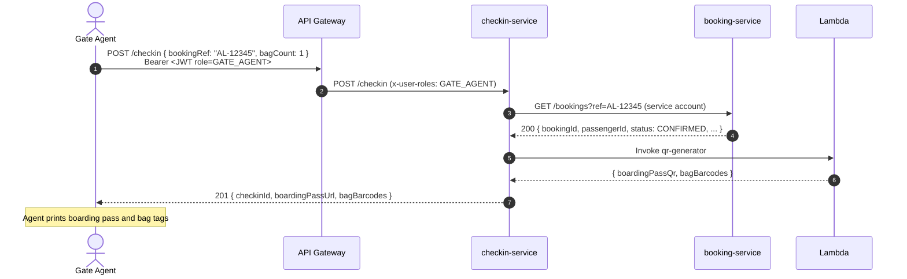
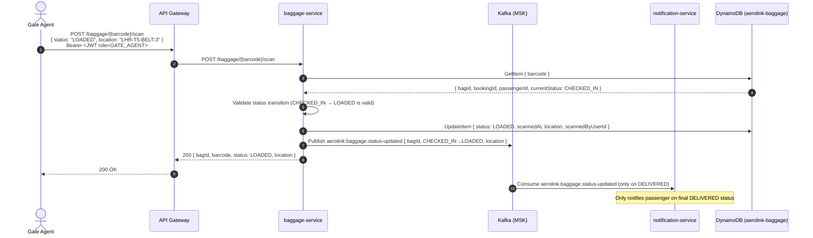
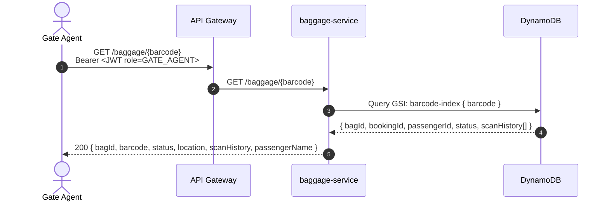

# Sequence Diagram — Check-in and Baggage Flow

## Web Check-in (Self-Service)

```mermaid
sequenceDiagram
    autonumber
    actor Customer
    participant APIGW as API Gateway
    participant CK as checkin-service
    participant BK as booking-service (REST)
    participant LMB as Lambda (QR Gen)
    participant BG as baggage-service
    participant NT as notification-service
    participant KFK as Kafka (MSK)
    participant DB as checkin_db (Aurora)

    Customer->>APIGW: POST /checkin { bookingId, bagCount: 2 }<br/>Authorization: Bearer <JWT>
    APIGW->>APIGW: JWT verify → role=CUSTOMER, userId=usr_123
    APIGW->>CK: POST /checkin (x-user-id: usr_123)

    CK->>BK: GET /bookings/{bookingId} (service account JWT)
    Note over CK,BK: Sync REST call — validates booking is CONFIRMED<br/>and belongs to this passenger
    BK-->>CK: 200 { status: CONFIRMED, flightId, seatNumber, ... }

    CK->>CK: Check eligibility:<br/>• status == CONFIRMED ✅<br/>• departure > 1h away ✅<br/>• not already checked in ✅

    CK->>LMB: Invoke lambda:qr-generator { bookingId, seatNumber, flightNumber, passengerName }
    Note over CK,LMB: Lambda generates boarding pass QR (PNG, base64)<br/>and 2 bag barcodes
    LMB-->>CK: { boardingPassQr: "data:image/png;base64,...",<br/>  bagBarcodes: ["1234567890", "1234567891"] }

    CK->>DB: INSERT CheckIn { checkinId, bookingId, passengerId, boardingPassId, gate, bagCount }
    CK->>DB: INSERT BoardingPass { qrData, barcode, seatNumber, gate, ... }

    CK->>KFK: Publish aerolink.checkin.completed { checkinId, bookingId, bagCount, boardingPassId }
    loop For each bag (bagCount = 2)
        CK->>KFK: Publish aerolink.baggage.tag-created { bagId, barcode, bookingId, weight, sequence }
    end

    CK-->>APIGW: 201 Created { checkinId, boardingPassUrl: "/boarding-pass/{id}/qr" }
    APIGW-->>Customer: 201 { boardingPassUrl, bagBarcodes: ["1234567890","1234567891"] }

    par Async downstream
        KFK->>BG: Consume aerolink.baggage.tag-created (×2)
        BG->>BG: INSERT BaggageItem { bagId, barcode, status: TAGGED, bookingId }
    and
        KFK->>NT: Consume aerolink.checkin.completed
        NT->>NT: Send boarding pass email with QR attachment via SES
    end

    Customer->>APIGW: GET /boarding-pass/{id}/qr
    APIGW->>CK: GET /boarding-pass/{id}/qr
    CK-->>Customer: 200 PNG image (boarding pass with QR code)
```

---

## Agent-Assisted Check-in (Gate Agent)



---

## Baggage Scan Flow (Gate Agent at Belt / Gate)



---

## Barcode/QR Lookup (Search Endpoint)



---

## QR Code Generation — Lambda

The Lambda function (`lambda-qr-generator`) is invoked synchronously by checkin-service:

```
Input:
{
  "type": "BOARDING_PASS" | "BAG_TAG",
  "data": {
    "bookingRef": "AL-12345",
    "flightNumber": "AE-204",
    "seatNumber": "14A",
    "passengerName": "SMITH/JOHN",
    "gate": "B12",
    "boardingTime": "14:30",
    "barcode": "1234567890"   // for BAG_TAG only
  }
}

Output:
{
  "qrData": "data:image/png;base64,<480x480 QR PNG>",
  "barcode128": "data:image/png;base64,<Code128 barcode PNG>"
}
```

Lambda uses the `qrcode` and `jsbarcode` npm packages. The function is packaged as a container image in ECR.

---

## Baggage Status Transition Rules

Valid status transitions (enforced by baggage-service):

```
TAGGED → CHECKED_IN     (when passenger drops bag at belt)
CHECKED_IN → LOADED     (when scanned onto aircraft)
LOADED → IN_TRANSIT     (when flight departs)
IN_TRANSIT → ARRIVED    (when flight lands)
ARRIVED → DELIVERED     (when collected from belt)
* → MISSING             (any status can transition to MISSING)
MISSING → ARRIVED       (found and processed)
```

Invalid transitions return `422 Unprocessable Entity` with the current status and allowed next states.
